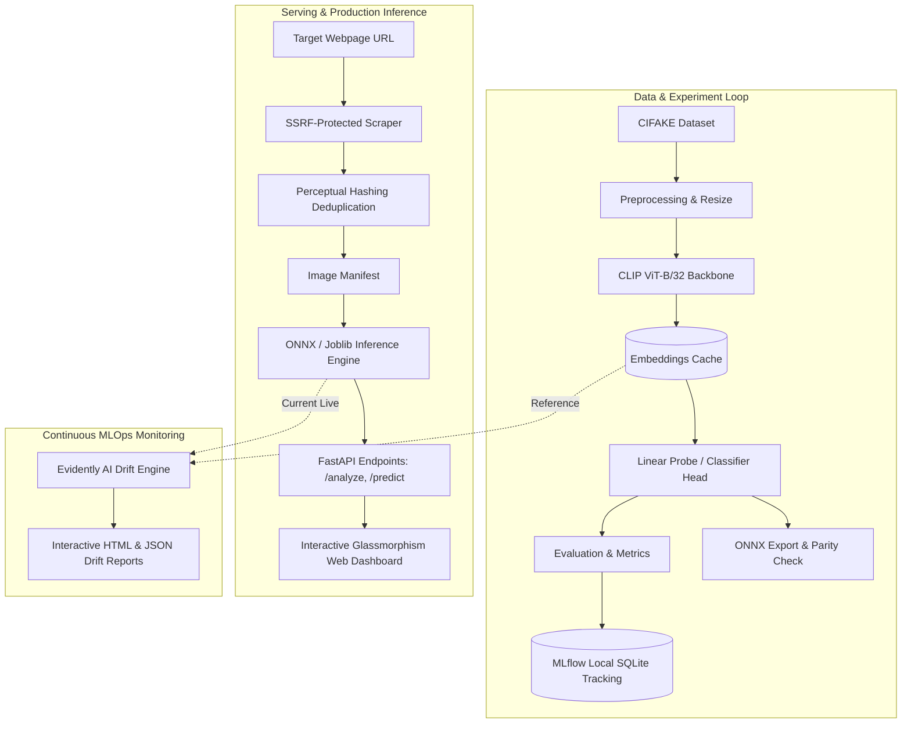

# 🛡️ AI Image Detection — Local MLOps Pipeline

[](https://www.python.org/downloads/)
[](https://mlflow.org/)
[](https://fastapi.tiangolo.com/)
[](https://onnxruntime.ai/)
[](#testing)
[](#security-audits)

A production-grade, local MLOps pipeline for extracting and detecting **AI-generated vs. authentic images** across web pages. Powered by frozen **CLIP ViT-B/32 visual embeddings**, a calibrated linear classification head, **MLflow 3.x tracking & model registry**, high-speed **ONNX Runtime** inference, an **SSRF-hardened web scraper with perceptual deduplication**, and **Evidently AI data drift monitoring**.

---

## 📐 Architecture Overview



---

## ✨ Key Features

1. **Frozen CLIP ViT Backbone + Calibrated Head**:
   - Uses OpenAI's `clip-vit-base-patch32` image encoder to project images into 512-dimensional normalized hyperspherical embeddings.
   - LogisticRegression / Linear Probe classifier head trains in seconds on CPU or GPU.
   - 2D FFT radial power spectrum extraction detects high-frequency periodic grid artifacts characteristic of generative diffusion and GAN architectures.
   - Hardware detection probe automatically handles novel architectures (e.g. NVIDIA Blackwell sm_120) with graceful multi-threaded CPU fallback.

2. **MLflow 3.x Experiment Tracking & Model Registry**:
   - Zero-server local SQLite backend (`sqlite:///mlflow.db`).
   - Tracks hyperparameters, accuracy, precision, recall, F1, ROC-AUC, confusion matrices, and ROC curves.
   - Logs formal MLflow model signatures for strict runtime input/output schema validation.
   - Automatic registration and versioning under `ai-image-detector-clip`.

3. **High-Performance ONNX Export & Cryptographic Integrity**:
   - Seamless ONNX graph export enables zero-Python-overhead inference with `onnxruntime`.
   - Cryptographic SHA256 checksum signatures (`.sha256`) prevent deserialization attacks and verify artifact integrity before loading.

4. **SSRF-Hardened Web Scraper with Perceptual Deduplication**:
   - Parses ``, `data-src`, `<source>`, and `srcset` tags.
   - Hardened against Server-Side Request Forgery (SSRF): blocks private IPv4/IPv6 ranges, link-local, loopback, and cloud metadata endpoints (`169.254.169.254`).
   - Validates each hop in HTTP redirects (preventing SSRF via Open Redirects).
   - Perceptual hashing (pHash and dHash) eliminates near-duplicate images with Hamming distance filtering.
   - Safe streaming with strict 15MB file size limits and image decompression bomb guards (`Image.MAX_IMAGE_PIXELS`).

5. **FastAPI Serving & Sleek Web Dashboard**:
   - `POST /analyze`: Scrapes any URL, deduplicates images, classifies each image, and returns structured probabilities.
   - `POST /predict`: Direct image upload endpoint for instant classification.
   - `GET /health`: Health status and active runtime provider details.
   - `GET /`: Interactive web interface featuring dark-mode glassmorphism, responsive image cards, real-time progress meters, and AI probability breakdown.

6. **Data Drift & Model Monitoring (Evidently AI)**:
   - Tracks feature distribution shift between reference training data and live inference batches.
   - Two-sample Kolmogorov-Smirnov and Wasserstein distance tests.
   - Generates standalone, interactive HTML drift reports and machine-readable JSON metrics.

---

## 🚀 Quickstart

### 1. Prerequisites & Environment Setup
Using `uv` (recommended) or standard `venv`:

```bash
# Clone the repository
git clone https://github.com/EricSiq/MLops-for-AI-Image-Detection.git
cd MLops-for-AI-Image-Detection

# Create virtual environment and install dependencies
uv venv .venv --python 3.11
.venv\Scripts\activate   # Windows (or source .venv/bin/activate on Unix)
uv pip install -r requirements.txt
```

### 2. Train the Model & Log to MLflow
Train on a sample subset (or full CIFAKE dataset) and export ONNX models:

```bash
python -m src.train --sample-size 500 --batch-size 32
```

To view the local MLflow dashboard:
```bash
mlflow ui --backend-store-uri sqlite:///mlflow.db
```
Open `http://localhost:5000` in your browser to inspect runs, parameters, metrics, and registered models.

### 3. Launch the API & Web Dashboard
Start the production FastAPI server:

```bash
uvicorn src.serve:app --host 127.0.0.1 --port 8000 --reload
```
- **Web Dashboard**: Open `http://127.0.0.1:8000/` in your browser.
- **Interactive Swagger Docs**: Open `http://127.0.0.1:8000/docs`.

---

## 🔌 API Usage Examples

### Analyze a Webpage URL
```bash
curl -X POST http://127.0.0.1:8000/analyze \
     -H "Content-Type: application/json" \
     -d '{"url": "https://en.wikipedia.org/wiki/Artificial_intelligence", "max_images": 20}'
```

**Response**:
```json
{
  "target_url": "https://en.wikipedia.org/wiki/Artificial_intelligence",
  "total_images_analyzed": 12,
  "ai_generated_count": 1,
  "real_count": 11,
  "ai_percentage": 8.33,
  "results": [
    {
      "image_url": "https://upload.wikimedia.org/.../example.jpg",
      "preview_url": "/previews/scrape_a1b2/img_001.jpg",
      "label": "REAL",
      "ai_probability": 0.0421,
      "real_probability": 0.9579,
      "confidence": 0.9579
    }
  ]
}
```

### Predict a Single Image File
```bash
curl -X POST http://127.0.0.1:8000/predict \
     -F "file=@path/to/my_image.png"
```

---

## 📊 Monitoring & Drift Detection

Generate on-demand drift reports comparing the reference baseline against current inference batches:

```bash
python -m src.monitor
```
Interactive HTML reports are saved to `reports/drift_report.html` and metrics to `reports/drift_metrics.json`.

---

## 🧪 Testing

Run the full automated test suite (23 unit and integration tests):

```bash
pytest tests/ -v
```

---

## 🔒 Security Audits & Vulnerability Remediation

Two comprehensive security and architecture audits were conducted:

1. **[Audit 1: Application, Network & Input Security](docs/audit_1_security.md)**:
   - **SSRF via Open Redirects**: Mitigated by validating every redirect hop against private and link-local IP blocks.
   - **Supply-Chain Revision Pinning**: Pinned Hugging Face model and dataset revisions to immutable commit tags.
   - **Decompression Bombs**: Enforced `Image.MAX_IMAGE_PIXELS = 50_000_000` and early MIME type filtering.
   - **Bandit AST Linting**: Clean bill of health with **0 vulnerabilities**.

2. **[Audit 2: MLOps Pipeline Integrity & Model Governance](docs/audit_2_mlops.md)**:
   - **Insecure Deserialization**: Standardized on ONNX runtime and added SHA256 cryptographic checksums for saved models.
   - **Model Signatures**: Enforced MLflow schema contracts (`infer_signature`).
   - **Leakage Prevention**: Guaranteed strict train/test isolation using frozen representations.
   - **Edge-case Hardening**: Guarded against degenerate single-color and extreme-aspect-ratio images.

---

## 📂 Project Structure

```
ai-image-detector/
├── data/                  # Cached dataset arrays and embeddings (.gitkeep)
├── docs/                  # Security & MLOps audit reports
│   ├── audit_1_security.md
│   └── audit_2_mlops.md
├── models/                # Serialized ONNX, joblib, and SHA256 checksums (.gitkeep)
├── reports/               # Evidently AI HTML and JSON drift reports
├── src/
│   ├── __init__.py
│   ├── config.py          # Centralized Pydantic settings & SSRF rules
│   ├── dataset.py         # CIFAKE loader with stratified sampling & caching
│   ├── inference.py       # High-performance ONNX / Scikit-Learn predictor
│   ├── model.py           # CLIP feature extractor & calibrated classifier
│   ├── monitor.py         # Evidently AI drift detection suite
│   ├── preprocess.py      # Transforms, safe loading & 2D FFT radial spectrum
│   ├── scrape.py          # SSRF-hardened scraper with perceptual deduplication
│   ├── serve.py           # FastAPI REST API and interactive web UI
│   ├── train.py           # MLflow experiment tracking & model registry pipeline
│   └── utils.py           # Logging, SHA256 hashing, and formatting helpers
├── tests/
│   ├── __init__.py
│   ├── conftest.py        # Shared test fixtures (PIL images, dummy embeddings)
│   ├── test_api.py        # FastAPI endpoint integration tests
│   ├── test_dataset.py    # CIFAKE dataset loading & caching tests
│   ├── test_model.py      # Classifier fitting, ONNX, and tamper detection tests
│   ├── test_monitor.py    # Drift detection tests
│   ├── test_preprocess.py # Preprocessing & FFT feature tests
│   └── test_scrape.py     # SSRF and perceptual hash deduplication tests
├── pyproject.toml         # Build and dependency configuration
├── requirements.txt       # Production dependencies
└── README.md              # Project documentation
```

---

## 📜 License
MIT License.