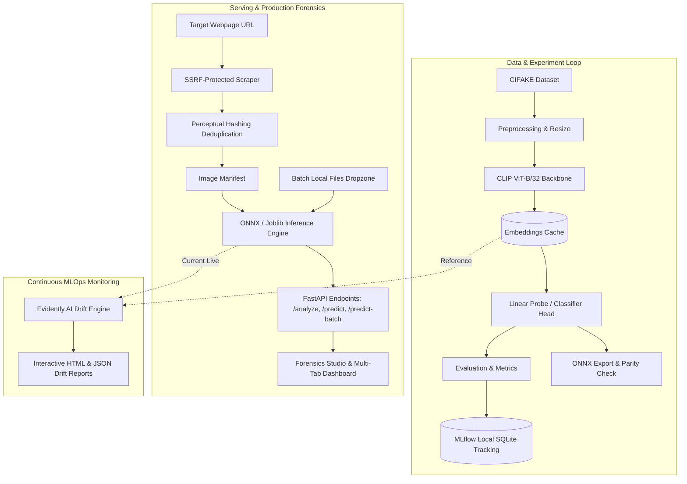

# AI Image Detection - Local MLOps Pipeline

[](https://www.python.org/downloads/)
[](https://mlflow.org/)
[](https://fastapi.tiangolo.com/)
[](https://onnxruntime.ai/)
[](#testing)
[](#security-audits-and-vulnerability-remediation)

A production-grade local MLOps pipeline and forensic inspection platform for extracting, inspecting, and detecting synthetic AI-generated versus authentic images across web pages and batch uploads. Powered by frozen CLIP ViT-B/32 visual embeddings, a calibrated linear classification head, 2D Fourier frequency-artifact heatmaps, MLflow experiment tracking and model registry, high-speed ONNX Runtime inference, an SSRF-hardened web scraper with perceptual deduplication, and Evidently AI data drift monitoring.

---

## Architecture Overview



---

## Key Features

1. **Forensic Studio Dashboard**:
   - Multi-tab interface: **Webpage Inspector**, **Forensic Studio & Dropzone**, and **MLOps Telemetry & Drift Hub**.
   - Structured typography with Inter and JetBrains Mono fonts, high-contrast dark theme, and responsive data grids.
   - Preset test sources for instant validation (reference articles, natural photography, and synthetic image collections).
   - Real-time telemetry indicators: active inference engine (`ONNX RUNTIME`), execution device, model registry tag, and average latency.
   - Client-side filtering controls: All, Synthetic AI, Authentic Natural, Uncertain (40-60%), and High Confidence (>85%).
   - Live search by filename or SHA-256 hash and multi-criteria sorting.
   - Export capabilities for JSON manifests and CSV summaries.

2. **Frequency Domain Forensic Inspection**:
   - Slide-over deep inspection modal for any analyzed asset.
   - **Dual-View Inspection**: Toggle between standard RGB visualization and the **2D Fourier Artifact Spectrum Heatmap** to reveal periodic grid patterns introduced by generative diffusion and GAN upsampling layers.
   - **Azimuthal Radial Power Spectrum**: 32-bin radial frequency profile plotting energy distribution from low-frequency structural shapes to high-frequency fine details.
   - Comprehensive metadata audit: SHA-256 hash, perceptual pHash, dHash, resolution dimensions, and latency breakdown.

3. **Multi-Image Drag-and-Drop Ingestion**:
   - Parallel batch uploads via `POST /predict-batch` for direct evaluation of local files without requiring external URLs.

4. **Frozen Foundation Vision Backbone**:
   - Uses OpenAI's `clip-vit-base-patch32` encoder to generate 512-dimensional normalized embeddings.
   - Hardware detection probe verifies kernel execution on startup, automatically falling back to multi-threaded CPU execution if incompatible GPU drivers are encountered.

5. **Experiment Tracking and Model Registry**:
   - Serverless local SQLite tracking backend (`sqlite:///mlflow.db`).
   - Tracks hyperparameters, accuracy, precision, recall, F1-score, ROC-AUC, confusion matrices, and ROC curves.
   - Enforces strict input and output schema contracts via MLflow model signatures.
   - Versioned registration under `ai-image-detector-clip`.

6. **Continuous Monitoring with Evidently AI**:
   - Telemetry hub integration via `/reports/drift` and `/monitoring/status`.
   - Two-sample Kolmogorov-Smirnov and Wasserstein distance tests to track feature drift and prediction distribution shifts.

---

## Quickstart

### 1. Prerequisites and Environment Setup

Using `uv` (recommended) or standard `venv`:

```bash
# Clone the repository
git clone https://github.com/EricSiq/MLops-for-AI-Image-Detection.git
cd MLops-for-AI-Image-Detection

# Create virtual environment and install dependencies
uv venv .venv --python 3.11
.venv\Scripts\activate   # Windows (or source .venv/bin/activate on Unix)
uv pip install -r requirements.txt
```

### 2. Train the Model and Log to MLflow

Train on a sample subset (or full CIFAKE dataset) and export the ONNX model:

```bash
python -m src.train --sample-size 500 --batch-size 32
```

To view the local MLflow dashboard:

```bash
mlflow ui --backend-store-uri sqlite:///mlflow.db
```

Open `http://localhost:5000` to inspect runs, parameters, metrics, and registered models.

### 3. Launch the Serving API and Dashboard

Start the FastAPI application:

```bash
uvicorn src.serve:app --host 127.0.0.1 --port 8000 --reload
```

- **Web Dashboard**: `http://127.0.0.1:8000/`
- **Interactive OpenAPI Documentation**: `http://127.0.0.1:8000/docs`

---

## API Usage Examples

### Analyze a Webpage URL

```bash
curl -X POST http://127.0.0.1:8000/analyze \
     -H "Content-Type: application/json" \
     -d '{"url": "https://en.wikipedia.org/wiki/Artificial_intelligence", "max_images": 20}'
```

**Response**:
```json
{
  "target_url": "https://en.wikipedia.org/wiki/Artificial_intelligence",
  "total_images_analyzed": 12,
  "ai_generated_count": 1,
  "real_count": 11,
  "ai_percentage": 8.33,
  "results": [
    {
      "image_url": "https://upload.wikimedia.org/.../example.jpg",
      "preview_url": "/previews/scrape_a1b2/img_001.jpg",
      "label": "REAL",
      "ai_probability": 0.0421,
      "real_probability": 0.9579,
      "confidence": 0.9579
    }
  ]
}
```

### Predict a Single Image File

```bash
curl -X POST http://127.0.0.1:8000/predict \
     -F "file=@path/to/my_image.png"
```

---

## Monitoring and Drift Detection

Generate on-demand drift reports comparing the baseline reference distribution against incoming production inference batches:

```bash
python -m src.monitor
```

Interactive HTML reports are saved to `reports/drift_report.html` and metrics to `reports/drift_metrics.json`.

---

## Testing

Run the automated test suite covering units, API endpoints, preprocessing, and model integrity:

```bash
pytest tests/ -v
```

---

## Security Audits and Vulnerability Remediation

Two security and operational audits were conducted:

1. **[Audit 1: Application, Network and Input Security](docs/audit_1_security.md)**:
   - **SSRF via Open Redirects**: Mitigated by validating every redirect hop against private and link-local IP ranges.
   - **Supply-Chain Revision Pinning**: Pinned Hugging Face model and dataset revisions to immutable commit tags.
   - **Decompression Bombs**: Enforced `Image.MAX_IMAGE_PIXELS = 50_000_000` and early MIME type filtering.
   - **Bandit AST Linting**: Clean bill of health with zero vulnerabilities.

2. **[Audit 2: MLOps Pipeline Integrity and Model Governance](docs/audit_2_mlops.md)**:
   - **Insecure Deserialization**: Standardized on ONNX runtime and added SHA-256 cryptographic checksums for saved models.
   - **Model Signatures**: Enforced MLflow schema contracts via `infer_signature`.
   - **Leakage Prevention**: Guaranteed strict train/test isolation using frozen representations.
   - **Edge-case Hardening**: Guarded against degenerate single-color and extreme-aspect-ratio images.

---

## Project Structure

```
ai-image-detector/
├── data/                  # Cached dataset arrays and embeddings (.gitkeep)
├── docs/                  # Security and MLOps audit reports
│   ├── audit_1_security.md
│   └── audit_2_mlops.md
├── models/                # Serialized ONNX, joblib, and SHA-256 checksums (.gitkeep)
├── reports/               # Evidently AI HTML and JSON drift reports
├── src/
│   ├── __init__.py
│   ├── config.py          # Centralized Pydantic settings and SSRF rules
│   ├── dataset.py         # CIFAKE loader with stratified sampling and caching
│   ├── inference.py       # High-performance ONNX / Scikit-Learn predictor
│   ├── model.py           # CLIP feature extractor and calibrated classifier
│   ├── monitor.py         # Evidently AI drift detection suite
│   ├── preprocess.py      # Transforms, safe loading, and 2D FFT radial spectrum
│   ├── scrape.py          # SSRF-hardened scraper with perceptual deduplication
│   ├── serve.py           # FastAPI REST API and interactive web dashboard
│   ├── train.py           # MLflow experiment tracking and model registry pipeline
│   └── utils.py           # Logging, SHA-256 hashing, and formatting helpers
├── tests/
│   ├── __init__.py
│   ├── conftest.py        # Shared test fixtures (PIL images, dummy embeddings)
│   ├── test_api.py        # FastAPI endpoint integration tests
│   ├── test_dataset.py    # CIFAKE dataset loading and caching tests
│   ├── test_model.py      # Classifier fitting, ONNX, and tamper detection tests
│   ├── test_monitor.py    # Drift detection tests
│   ├── test_preprocess.py # Preprocessing and FFT feature tests
│   └── test_scrape.py     # SSRF and perceptual hash deduplication tests
├── pyproject.toml         # Build and dependency configuration
├── requirements.txt       # Production dependencies
└── README.md              # Project documentation
```

---

## License

MIT License.